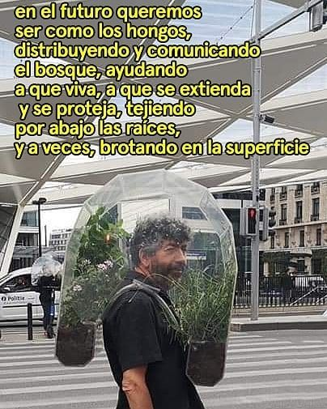

# Lo que no hablamos {#lqnh}

otra vez

quedo sola en casa y no sé qué hacer

de aburrida

me someto a un juego de seducción imposible con una piba

hermosa que me cuelga los mensajes pero cuando

me responde me promete

ganas de vernos y sin decirlo una fiesta

biensonante de las pasiones

de amorosa

entusiasmo cariño sin decirlo y mando esos memes esos memes

de apoyo lindo y aguante a seres

que jamás vi en vida

porque de manos largas para querer y confundir

cierto clima con turbios fenómenos de época se trata

tal vez la bola de tejer alianzas entre nosotras

una sensibilidad común

de algún modo

más o menos pero más menos que más 

amable

expropiada entre genuinas señales de necesidad y deseo

para mal y para mí

y de borracha pienso mil cosas

que no enrostramos ni afiebradas porque a veces

lo preferible es esta guía de preguntas estudiantiles tan siempre

mal formuladas a la rabia que nos compete y convoca

si por las tardes la tensión ahora es adónde está

el silencio

en dónde la canción

y dónde ese ruidito que pasa por detrás tabanero

como una fauna que no vemos en la especie nuestra que enajena

de su vientre sensible la construcción de un ambiente

propicio para nosotras mi reina

si en la abstracción socializante las penas duran lo que un potro en el tarro

y son gases expandiéndose en el aire para no chocarse

nos queremos

las caritas

con las resolanas frías pero al sol son pan 

de muerto la raíz entre el teclado no nos mata ni nos hace más fuertes

más bien muta y lo vuelve a intentar

ojalá que en el futuro seamos como plantas

para crecer de noche y al calor

de la luna hacernos grandes y posibles

nuestras cuerpas las ideas

floreciendo siempre 

en lo oscuro

porque a todo esto quise beber del arenal

puse mis músculos en hidroponia

para enredar en nuestros ojos los fantasmas

que en cada suspiro libertamos

y no salvé ni mi lengua del atoro

de este ritual traslaticio madurado en frascos rotos
