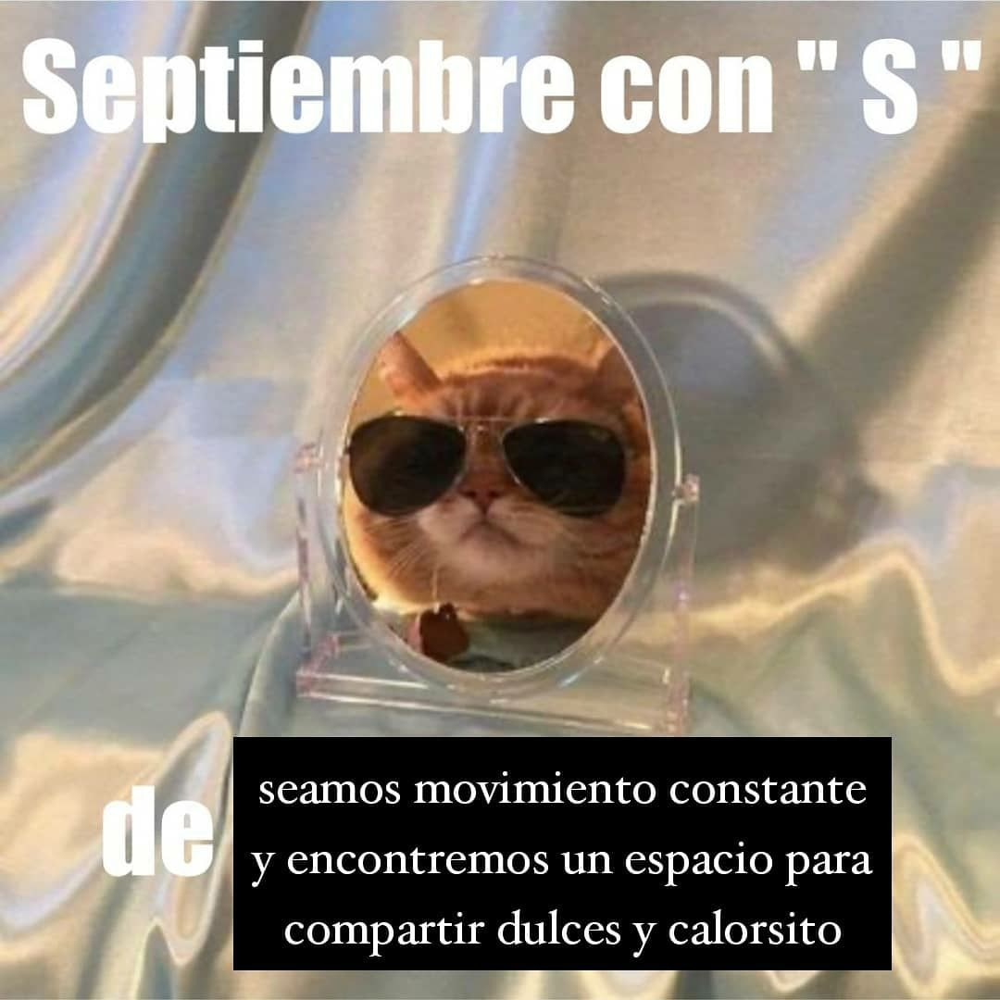

# Su paso un círculo de ceniza

ya adivino el ronroneo

de les gatis que al acecho

van marcando mi retorno

del sueño a la vigila pero también

de un clima a otro

lo acomodan a

pura pose larga o fetal casi como dedos

brujos que en el movimiento

surten el conjuro

la necesidad ontológica de convertir la casa

en corazón de batucada silban

y son ellos las que silban podría

decirse franqueando la herida

abierta de la domesticación asilvestrada

porque un gato en cada casa o más

es civilización latente y una toma

del poder se sabe entonces

en su delirio encuentran

siempre a través de otros ojos en cada rostro el rostro del poeta

que por ellos clama sin rescate

perdón señor perdón señora

por mear el árbol de su cora

observan dijimos

observan desde una medianera estrellada algo perdida

el baldío o

la muerte o

la grupa entre los contenedores de la supervivencia quizá el futuro

del afecto carpincho entre nosotras

a contrapelo del psicoanálisis y los desiderativos antropocénicos

porque es otro orden estremecido de pelaje

nunca una mirada bienhabida que consagre las leches de

lo mojado a un malambo

errante por ejemplo

el abejorro

se diría traza

ahora una línea penetrante

en la cancelación

de la existencia estira su extinción y dice mundo

va haber mundo

para siempre

mi vida es efímera y fortuita y al polvo vuelve trascendente

pero los felinos traman incluso hasta

tejen se diría

las olas de la pampa que brotan en una vereda

porque es suya la ciudad en ruinas

y lo saben

la sinfonía agorrionada de los futuros desplomados

sobre sí

mejor dicho devuelven en captura la alianza

interespecies de una comunidad imposible a los trotes mansos de fuerzas que nunca debimos no

y lo sabíamos haber desafiado ay

es otro corte mamífero la peluza transmutada de les gatis

su quejido un codo de amor sublunar y silencioso

no por aspereza pero la rambla conjuga

una manada guerrillera

gatis contra el reino de la mercancía

sino por la anónima utopía

de armar querencia con garritas

