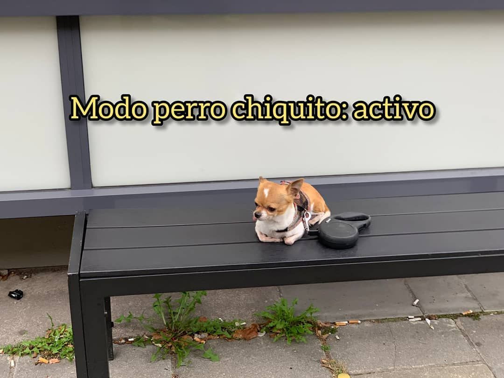

# salario precio y ganancia

desde que me sacaste esa foto

durmiendo las manos

entre las rodillas y un

almohadón sobre la cara

dejé de preguntarme cuánto hay

de capricho y cuánto de necesidad

en la gestualidad de nuestro comportamiento cotidiano

ahora salgo a pasear un día

de sol las vidrieras

entre mi jornal y el

deseo voy a ellas como endemoniado

para rebotar a fuerza del mantra

estoy contento con el producto que compré y no tengo

que seguir mirando opciones más baratas

estoy contento con el producto

que compré y no tengo

que seguir mirando opciones más baratas

y si hay un interruptor

entre mi intensidad afectiva y

mi modo perro chiquito activado meta

aislamiento concentrado

quizá se llame menos masculinidad

frágil en picada que también pero más

autogestión precarizada de la ansiedad

porque hacemos lo que podemos

con lo poco que tenemos

en esta distopía sensible en la que

después millones de años de experiencia humana no

sabemos distinguir

entre el hambre y la sed

entonces cómo ser lindas en un mundo horrible

entonces cómo afectarse para el calor

que o nos convoca

o nos amenaza