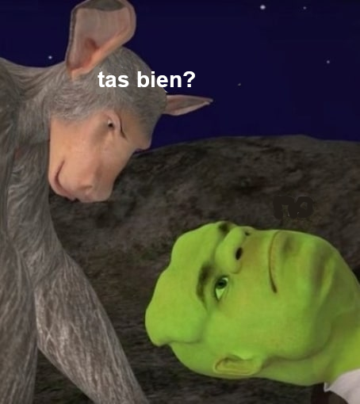

# destajos de sensibilidad

es la hora santa

peluches de mañana

se quedan

en mi cora

para siempre

cuando ellxs marchen sabrán

cargar las armas de esta guerra

(shrek despierta:

somos espíritus afines en la lucha por destituir lo humano

lo euroblanco lo civilizado)

el dembow se empuña como

un calor la cama un boliche

de contaminación

barroca

mestiza

si esta parva de cotorras en orgía

resiste la infiltración de policías

sólo falta lo que falta (viva chile

y lxs que faltan se quedan

para siempre

en nuestro cora