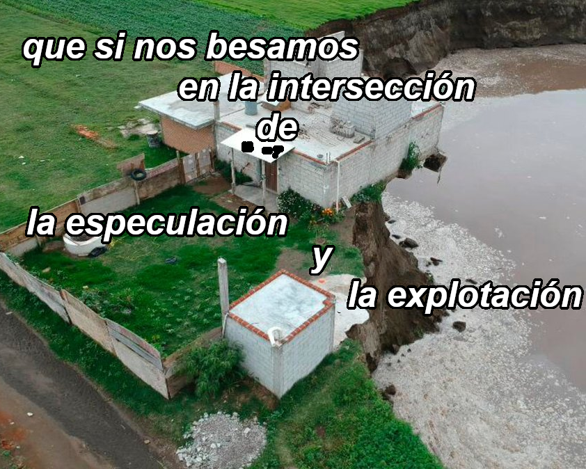

# será que nos gravita creciente la luna

de juntar junquito seco para armarle

un nido al fuego y a pesar

de malos consejos de chabón

convertir brujamente la brasa en pájaro

paso ahora

la mano una llama de ebriedad y frío

a escuchar con tu amiga

las vibraciones nocturnales del río

“estoy inventando un ritual” 

dice y en lo oscuro 

nos corremos 

del calorcito para crearlo nosotras 

dulces corrientes de aire me ondulan 

las piernas y de pronto sos vos 

y de pronto es tu cariño

el cuero húmedo de este estuario 

mareado ya no de escabio

entre la noche y su estrella
