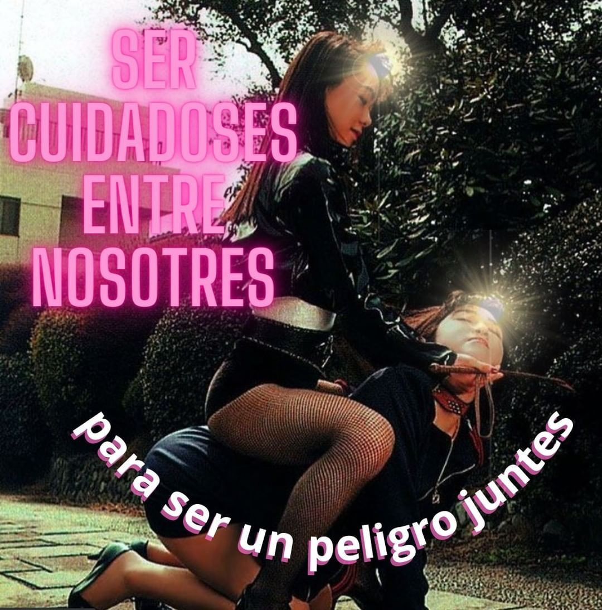

# me pierdo en un bordoneo porque bordoneando

me abandono de la palabra y quiero que seas

ahora de mi silencio una traba

o que en el diantre de la autoformación subjetiva constante de nuestras ánimas populares en este siglo eterno y flagelante

algo calle

de pronto

y pase o de paso al viento

me achaque de lo mío y junte la violencia

aprendida del mundo en mi carne

sea un desliz que por favor no te toque ni te muerda

porque quiero también ser una rémora vertiginosa de papeles quemándose 

en aceite usado o de ese orden malabar

medio curado por las nuevas narrativas metropampeanas con mueca cyborg 

como si quisiera todo el tiempo saber cómo 

se actualizan

las sensibilidades clasemedieras más perturbadas

me canso y me hundo puede ser

en las ruedas del calor que te convocan

por puro desperdicio por puro

año viejo recuperado en dos croquetas mal hechas de todas

las cosas

que amé y perdí

es que a veces

el vamoacharlarlo mejor se cancela y deja

espacio a otros fluidos discursivos

que toman tal vez la forma de un bardito o una mosca en el espacio

y decidamos no matarla decidamos

que lata con tal de sentir nuestros coras sobrevolando el enrosque

sonando con mayor o menor intensidad según su errancia

antes de que vuelvan finalmente monigotes

las bandurrias perdidas como un reflejo

casi nocturno de un mar árido quizá

o de esa lata de cerveza vacía que nos mira desde un charco en la vereda

a confundirse con nuestros sueños

sueños mochos exiliados del tiempo

pero que el beso de suelo y cielo todavía reclaman para sí

y devoran insecticidas las soledades cosechadas de tanta 

calaña semiautoinflingida

que surcan modo cáscara las paredes y los campos

porque somos ese pasto y yo te quiero

tanto 

que a nosotras van

mis horas jóvenes como fantasmas de una nuca que te sopla para no

asediar las introspectivas intocables ni enredar

de más las lenguas en el cuero

de este apocalipsing performado en el entonces qué

nos gotea y de ahí

de nuevo la mosca de un favor entumecido 

donde ya no sé sabe quién le debe qué a quién

todo eso estremece y se cuece 

en el sendero semiurbano que elegimos juntas 

caminar pero sin saber nunca

bien adónde lleva

ni quién lo traza realmente tengo

en las líneas de tu mano la silueta de mi cuerpa mixturada

por la sangre celeste y la biografía periférica

por la historia de esta tierra que se nos cuela por todos los agujeros y las venas

esa es la única huella que sigo

y ojalá me pierda