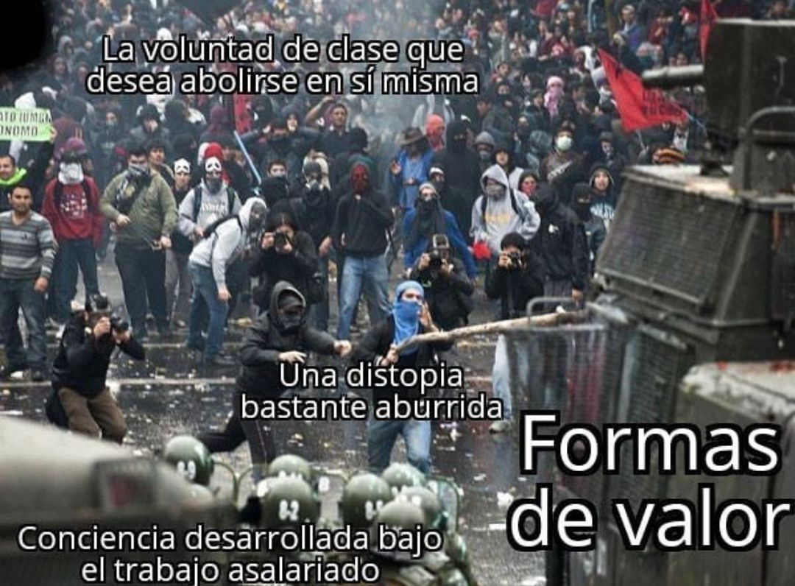

# formas del valor

montarse sobre dos ruedas te

corta la bocha de una secuencia larga

el rodado mínimo hace de la perspectiva

un corcho o un ataúd pronunciado

para la visibilidad de las curvas

donde el relieve y lo que se corta

en la tarea holística de diagramar una ciudad

saben decir “estas aves

están migrando sobre mí” o “mijael

rodríguez número 221 743-1982

perdió en esta esquina su billetera”

son las visiones que te hacés mientras

pedaleamos en la lluvia y a la carga

los perros vivos del trabajo precario

generando energía o liberando

plusvalor en la tracción de un paquete

que hay que entregar fresco

ya sea helado poesía u otros plásticos

en la carrera soltada de nuestros espantos

en las vías corridas de qué cadenas

de distribución y alarma porque viene

envenenada esta manzana de coltán

y tenemos internet cinco ge y un alfajor

de seitán gluten fri pero nuestras vidas

siguen más o menos igual veo el tendido

eléctrico marcar nuestro recorrido

mientras en la plaza alguien agita en la guitarra

canciones de misa: alaridos

que no claman ya más nada

mucho menos trascendencia -solamente

un desagüe de ilusión para las ranas

que encuentre mijael su billetera
