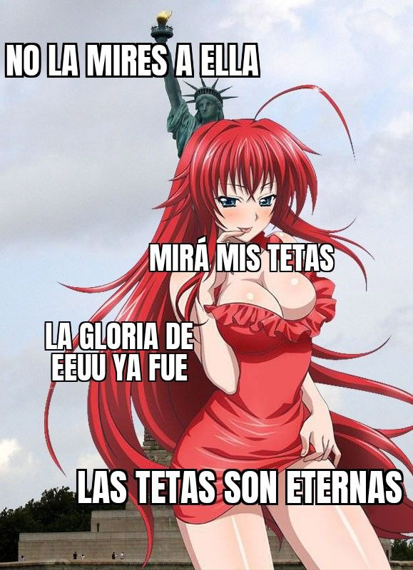
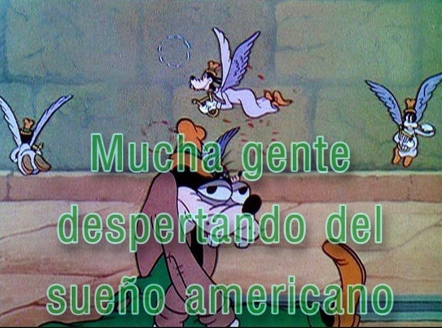

# tkm btw

    _podríamos ser tan buenos, sino fuera por las circunstancias!_
    s. zizek

de pasta en pasta viven los yanquis pobres

dan penita ni bien verlos

en el cobertizo, en las paredes

hay un agujero negro que los traga

les imprime en la madera una señal bifronte

primero para el anca tibia y puritana

donde mi amigo les tatuó un lovecraft entumecido

por la marea de todos los océanos conquistados

en la otra faz un jimi hendrix con cadenas

industriales la cabeza

de águila imperial se pasa de rosca y babea

senil la gota gorda protestante

en pose onda san jorge lobotomizado

cositas

imaginaron una colina y vaya

que la levantaron sí

ahora tiene ese pico la cabeza medio torcida medio

carbonizada con la forma y los ojos de jeff bezzos

vuela en un cohete flácido hacia el vacío más cruel

y nuestro reptiliano favorito el que maneja

los mil feedlots algorítmicos de la mercancía 

digital?

ay digo

no se le queman en ningún

ritual de sanación los bitcoins arrugados sus pasiones

maquínicas

la sangre fría tiene como todo

sus efectos colaterales

y al pobre hombre al más hondo 

explorador de la humanidad que los padres fundadores

que los primerísimos pioneros jamás imaginaron

a los treintipico años 

no se le para

y sin embargo todas tenemos sus pudores

nocturnos bien impresos en las manchas

de nuestras remeras

porque no somos acaso, de mañana

y de tarde imagen 

y semejanza de estos ay tan tiránicos y modernos dioses nuestros?

dioses tristes podés decir

para el olimpo del proceso del valor

en tu sensibilidad y en la suya

y en la mía también habita un fondo de inversión

un conglomerado empresarial que

aparece

blurreado

pero bien que lo amamos

le dedicamos la fatiga y el logo

capitán amérika en cada niño del condado

mientras suena el aspaviento como un tanque sobre la escarcha

y recorre nuestros barros cantando épicas bélicas

con voz de gallo al ladrido de los perros

invisibles todavía pero epa

muy bien representados

casi como en un

cuadro realista se arden

en nuestras lenguas y cuerpas

entonces una pesadilla agria da vueltas al mundo con métrica vintage

quiere declamar su perigeo shitpostero con no sé qué

poesía del yo la lírica oxidental

como un modo de anunciar las profecías primordiales

pero cruzadas de hospicios y demonios todos

en la misma peli

moribunda de terrores liberales crezcan siempre

en tu pechito sideral

un dólar a la frente de cada animal pero también

de cada ánimo intersectado por la

circulación de capital ficticio unas croquetas

puestas en abismo

no digamos

fascismo o distopía

ni el candado

se abra oxidado en la reserva federal más netflixera

porque quién o cuántas van

a liberar el código de los astros

para la bajeza aspiracional que corre

como perro koi contra la corriente

periférica de la tasa depresiva de ganancia

si la colina de la capitol hill ahora termina

donde empieza mijos

su patria expandida de yerifs angustiados

en modulación barroca o de humo o de falopa

casi ozymandias de calores bajos

erosionándose fieramente con los vientos inclementes de la historia

un sol que nació

pobrecito hay que decirlo

algo idiota

y se reduce ahora de vuelta a su aldea y a la nuestra

se corta el chorro que da lástima

parda y culposa de que el mago blanco en su

blanca demencia nos deje de soñar

el alma súbita y el estrago

de su pico diamantino que horada los cueros nuestros

ni un imaginario fluviar sin enturbiar

ni un materialidad futura sin contaminar

que nos han dejado

para la pírrica hora de los pueblos