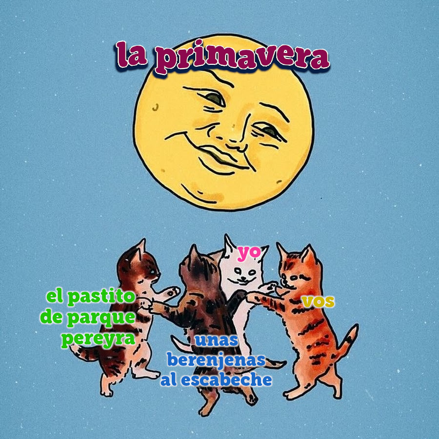
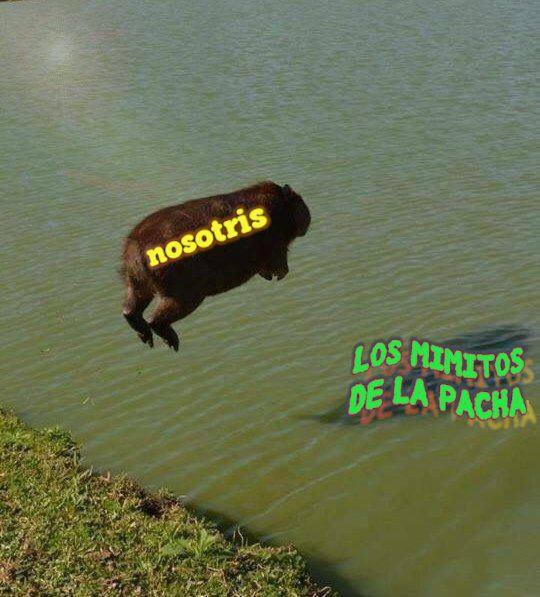

# un himno para nuestra junción

si las profecías climatológicas que anuncian que para el sábado

estaremos libres ya de esta lluvia espuria

no erran como tienen por costumbre

a lo mejor 

digo 

podríamos ir al parque		

como supimos convenir a celebrar un aquelarre de invocación a la primavera

meta porro vino y lo que sea

atendiendo por otro lado el llamado de la naturaleza cíclica

porque somos fantasmas nunca ángeles y no sabemos 

cuándo invocamos y cuándo estamos siendo invocadas

estas  son nuestras presencias jóvenes que laten desde atrás y huelen las  flores y se visten lindo o 

trabajan cuando pueden la forma de su espalda

tengo también para mí el sonido de los pájaros como evocación

de los árboles altos que mueve el viento -y a los enamorados el pensamiento- pero también de una manera de la amistad

que paseando por las calles rosarinas me refería las características de la avifauna local 

sonante a nuestros pasos

una  de las aves en cuestión lo que hacía por ejemplo era ocupar los  nidos de otras especies como gesto territorial expulsivo

otra era yo

tarareando barrio barrio

que tenés el alma inquieta de un gorrión sentimental

pasó ya el tiempo desde entonces pero de igual modo toda esa distancia todavía nos desune nos vuelve a unir y así sucesivamente

a nosotras nos separa otro bordoneo espectral 

que galopa por los rieles pero también toda una extensión de pampa que se abisma por selváticos senderos

de bruma color nuestros vapores

con distinta gradación de luces sombras y espesores

para que floten libremente como soles

y viajen el uno hacia el otro sin apenas conocerse

nuestros ímpetus de gozosos corazones

porque llega la primavera y lo saben nuestras cuerpas

en ese tren las vestimos las disponemos

y en ese tono ajustamos lo mismo nuestras lenguas que dicen sí

nos veamos tengo ganas me pinta la idea qué planazo

porque el deseo es más de rodearse de pasto y de furor 

florecido pero también 

de pieles en roce incluso bocas que se juntan y se chupan

sutilmente en el chat y en el encuentro

presencial quién sabe

quisimos venir al parque y ver

árboles hongos

flashar romance en forma de amistad

y conocer la armonía la dulce policronía de las tardes fabriqueras 

desde la ventana empolvada

de un furgón muchacho mientras venimos

y entronamos en nuestras cabezas el decoro recíproco de maquinar

cómo me pongo linda para vos

si te prometí implícitamente cariño y fantasía

un alma brava a vos dispuesta

cómo vamos además a caer

en ese abismo de pasaje

a otras formas de escanciar lenguas y cuerpas

me decís

te quiero mucho por escuchar mis playlists

te digo

hice este meme para manijear nuestra juntada

aunque de tan candombe una me arruine

me corte de mandinga y me acuerdo de lo mío

porque ahora quiero

que veas mi casa una sirena que se enreda en estrellas de cemento sobre una ciudad cruzada

y florece para vos

sin aguantarse a que despeje

regida puramente por la pasión estacionaria a la fuerza de tu cara

performada en una selfi sacada exclusivamente entre nosotras

entonces los árboles los árboles

que arrancan a mosquearse a nuestra gira

pastito bragado de hormiguitas que somos

soñantes de marisma y distancia bien rompida

porque es eso el parque se presta a una

proxemia pagana que sabemos construir

con sudor y sin pudor

para apoyar el mantel con parsimonia fornida en el agujero del arenal

cosa de hacer del espacio una fuga temporal merecida por nuestro agite

y nos arrimemos 

a compartir el vino el calorsito estas pulsiones

de sábado hermoso

armado

meramente

a las señas varias del amor súbito en mansedumbre

mientras con los ojos cholos contemplamos la caída

brusca de la civilización occidental pero también

de sus tipologías del afecto

embrutecidas en la gestión mercantil de los deseos

y ruedan en nuestras manos de mediodía la belleza que nos junta

y ese polen que exhalan sin vergüenza las veredas y los bosques

como cantando un poema lírico sobre la importancia

de expropiar espacios verdes

a distancia proletaria

entre metrópolis terribles

donde mechar una lona y hacer el fuego que nuestros coras piden con ramitas y hojas secas

los celulares en silencio sólo las corrientes de aire dirigiendo 

la música de la noche esa estrella borracha

que al calor de la luna nos vuelve extrañas de hermosura

pero grandes y posibles

porque mientras la carne se macera en la brasa que nos abriga algo somos

de utopía y de asedio y de incandescencia y nunca unas

manos al humo

solitarias no

abolimos la soledad y también la felicidad

más al fondo entonces las cumbias retumban como un eco de guaracha

un grito de guerra para la necesidad de una danza taimada que ponga en juego

la necesidad física

abreve los placeres

al cauce del viento y de nuevo a los pájaros

que no por chirria son capaces de sonar al compás de las vestiduras humanas

sus rituales nocturnos concedidos al brebaje espirituoso

materia afín que nos arrastra la una tan cerca

tan cerca de la otra

son orejas de la precariedad y el aislamiento nuestros pulsos

pero que vienen desde antes se diría acaso

los tiempos de la colonia y el trabajo

rastro que habita a todo esto en la corteza milenaria de nuestros cueros y ambientes sobre los que quizá

ahora nos recostamos suaves ya cediendo ya sedientas

ya no de alcohol sino de estos jugos

que nos regala el nuevo clima

a las anatomías jóvenes no

sino a las corazonas que cancelamos lo más gris de este futuro

y marcamos nuestro pecho

con sangre arrebatada a los flujos

incesantes del valor para preparar así con todas

las armas de la querencia

nuestro gesto barroco

de inventarnos una vida en medio de la muerte
